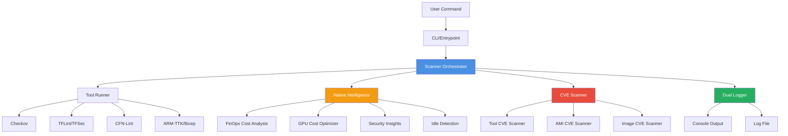

# DevOps Universal Scanner v3.0

**Comprehensive Infrastructure as Code Security Scanner**

A Docker-based security scanner for multi-cloud infrastructure code with intelligent analysis, FinOps insights, and CVE detection. Built with pure Python 3.13 for speed and efficiency.

## Quick Start

```bash
# Pull the image
docker pull spd109/devops-uat:latest

# Scan your infrastructure
docker run --rm -v "$(pwd):/work" spd109/devops-uat:latest scan-terraform terraform/
```

## What Makes This Different

- **One Command Structure** - Consistent interface for all scan types
- **Multi-Cloud Support** - AWS, Azure, GCP, Kubernetes
- **Native Intelligence** - FinOps cost analysis, AI/ML GPU optimization, CVE scanning
- **Comprehensive Logging** - Full terminal output with timestamps
- **Lightweight** - ~700MB Alpine-based image (30-40% smaller than v2.0)
- **Pure Python 3.13** - No bash scripts, modern codebase

## Architecture



### Engine Flow

```
┌─────────────────────────────────────────────────────────────┐
│                    User Command (CLI)                        │
└─────────────────┬───────────────────────────────────────────┘
                  │
                  ▼
┌─────────────────────────────────────────────────────────────┐
│              Scanner Orchestrator (core/scanner.py)          │
│  • Auto-detects file types                                   │
│  • Manages execution flow                                    │
│  • Coordinates all layers                                    │
└─────┬───────────────────┬───────────────────┬───────────────┘
      │                   │                   │
      ▼                   ▼                   ▼
┌─────────────┐  ┌──────────────────┐  ┌─────────────────┐
│ Tool Runner │  │ Native Analysis  │  │  CVE Scanner    │
├─────────────┤  ├──────────────────┤  ├─────────────────┤
│ • Checkov   │  │ • Cost Analysis  │  │ • Tool CVEs     │
│ • TFLint    │  │ • FinOps Recs    │  │ • AMI CVEs      │
│ • TFSec     │  │ • GPU Analysis   │  │ • Image CVEs    │
│ • CFN-Lint  │  │ • Idle Detection │  │ • Live Updates  │
│ • ARM-TTK   │  │ • Live Pricing   │  │                 │
└─────┬───────┘  └────────┬─────────┘  └────────┬────────┘
      │                   │                      │
      └───────────────────┴──────────────────────┘
                          │
                          ▼
      ┌────────────────────────────────────────────┐
      │       Dual Logger (core/logger.py)         │
      ├────────────────────────────────────────────┤
      │  • Console: Live feedback with colors      │
      │  • Log File: Timestamped complete record   │
      └────────────────────────────────────────────┘
```

## Supported Scan Types

| Command | Purpose | Tools Used |
|---------|---------|------------|
| `scan-terraform` | Terraform configurations | TFLint, TFSec, Checkov |
| `scan-cloudformation` | CloudFormation templates | CFN-Lint, Checkov |
| `scan-docker` | Container images | Trivy (vulnerabilities, secrets, misconfigs) |
| `scan-arm` | Azure ARM templates | ARM-TTK, Checkov |
| `scan-bicep` | Azure Bicep templates | Bicep CLI, Checkov |
| `scan-gcp` | GCP Deployment Manager | Checkov, GCloud validation |
| `scan-kubernetes` | Kubernetes manifests | kube-score, Kubescape |

## Usage Examples

### Basic Scans

```bash
# Linux/macOS
docker run --rm -v "$(pwd):/work" spd109/devops-uat:latest scan-terraform terraform/

# Windows PowerShell
docker run --rm -v "${PWD}:/work" spd109/devops-uat:latest scan-terraform terraform/

# Windows CMD
docker run --rm -v "%cd%:/work" spd109/devops-uat:latest scan-terraform terraform/
```

### Platform-Specific Examples

<details>
<summary><b>Terraform</b></summary>

```bash
docker run --rm -v "$(pwd):/work" spd109/devops-uat:latest scan-terraform terraform/
docker run --rm -v "$(pwd):/work" spd109/devops-uat:latest scan-terraform main.tf
```
</details>

<details>
<summary><b>CloudFormation</b></summary>

```bash
docker run --rm -v "$(pwd):/work" spd109/devops-uat:latest scan-cloudformation template.yaml
docker run --rm -v "$(pwd):/work" spd109/devops-uat:latest scan-cloudformation cloudformation/
```
</details>

<details>
<summary><b>Docker Images</b></summary>

```bash
docker run --rm spd109/devops-uat:latest scan-docker nginx:latest
docker run --rm spd109/devops-uat:latest scan-docker myapp:v1.0
```
</details>

<details>
<summary><b>Azure (ARM/Bicep)</b></summary>

```bash
docker run --rm -v "$(pwd):/work" spd109/devops-uat:latest scan-arm template.json
docker run --rm -v "$(pwd):/work" spd109/devops-uat:latest scan-bicep template.bicep
```
</details>

<details>
<summary><b>GCP & Kubernetes</b></summary>

```bash
docker run --rm -v "$(pwd):/work" spd109/devops-uat:latest scan-gcp template.yaml
docker run --rm -v "$(pwd):/work" spd109/devops-uat:latest scan-kubernetes manifests/
```
</details>

### With Cloud Credentials

```bash
# AWS
docker run --rm -v "$(pwd):/work" \
  -e AWS_ACCESS_KEY_ID \
  -e AWS_SECRET_ACCESS_KEY \
  spd109/devops-uat:latest scan-cloudformation template.yaml

# Azure
docker run --rm -v "$(pwd):/work" \
  -e AZURE_CLIENT_ID \
  -e AZURE_CLIENT_SECRET \
  spd109/devops-uat:latest scan-arm template.json

# GCP
docker run --rm -v "$(pwd):/work" \
  -e GOOGLE_APPLICATION_CREDENTIALS=/work/service-account.json \
  spd109/devops-uat:latest scan-gcp template.yaml
```

## Output Files

Each scan generates:

1. **Detailed Log** (`*-scan-report-YYYYMMDD-HHMMSS.log`) - Complete timestamped output
2. **Summary Report** (`*-summary.txt`) - Human-readable findings overview

### Example Output

```log
=================================================================
              TERRAFORM SECURITY SCAN REPORT
=================================================================
Target: terraform/
Scan Started: 2025-11-19 14:30:45 UTC
Tools: TFLint, TFSec, Checkov
=================================================================

[2025-11-19 14:30:45] ✅ Running TFLint...
[2025-11-19 14:30:47] ⚠️  Found 3 issues
[2025-11-19 14:30:47] ✅ Running TFSec...
[2025-11-19 14:30:50] ❌ Found 12 security issues
[2025-11-19 14:30:50] ✅ Running Checkov...
[2025-11-19 14:30:55] ⚠️  Found 8 policy violations

=================================================================
                    NATIVE INTELLIGENCE
=================================================================
💰 Cost Analysis:
   • Monthly: $1,247.50
   • Potential Savings: $936.25 (75%)

🎯 FinOps Recommendations:
   • Use Reserved Instances (save $498/month)
   • Implement business hours scheduling (save $389/month)
   • Switch to gp3 storage (save $49/month)

🔍 CVE Scan:
   • No vulnerabilities in AMI ami-12345678
```

## Image Details

- **Base**: Alpine Linux 3.21.3
- **Size**: ~700MB (35% smaller than v2.0)
- **Python**: 3.13
- **Architecture**: Multi-platform (linux/amd64, linux/arm64)
- **Registry**: [Docker Hub](https://hub.docker.com/r/spd109/devops-uat)
- **Tags**: `latest`, `YYYYMMDD` (e.g., `20251119`)

### Performance Improvements

| Metric | v2.0 | v3.0 | Improvement |
|--------|------|------|-------------|
| Image Size | 1.02GB | ~700MB | 31% smaller |
| Pull Time | 3-4 min | 2 min | 40% faster |
| Build Time | 2.5 min | 1.1 min | 56% faster |

## Test Files

The repository includes intentionally vulnerable test files in `test-files/` for validating scanner capabilities.

**⚠️ WARNING**: These files contain security vulnerabilities and misconfigurations. **NEVER use in production!**

### Run Tests

```bash
# Test all scanners
docker run --rm -v "$(pwd):/work" spd109/devops-uat:latest scan-terraform test-files/terraform/
docker run --rm -v "$(pwd):/work" spd109/devops-uat:latest scan-cloudformation test-files/cloudformation/
docker run --rm -v "$(pwd):/work" spd109/devops-uat:latest scan-kubernetes test-files/kubernetes/
docker run --rm spd109/devops-uat:latest scan-docker nginx:latest
```

### Quick Validation

```bash
# Windows
validate-setup.bat

# Linux/macOS
chmod +x validate-setup.sh && ./validate-setup.sh
```

## CI/CD Integration

<details>
<summary><b>GitHub Actions</b></summary>

```yaml
name: Infrastructure Security Scan
on: [push, pull_request]

jobs:
  security-scan:
    runs-on: ubuntu-latest
    steps:
      - uses: actions/checkout@v3

      - name: Scan Infrastructure
        run: |
          docker pull spd109/devops-uat:latest
          docker run --rm -v "$(pwd):/work" spd109/devops-uat:latest scan-terraform terraform/

      - name: Upload Reports
        uses: actions/upload-artifact@v3
        with:
          name: security-reports
          path: '*-scan-report*.log'
```
</details>

<details>
<summary><b>GitLab CI</b></summary>

```yaml
infrastructure-security:
  stage: security-scan
  image: docker:latest
  services:
    - docker:dind
  script:
    - docker pull spd109/devops-uat:latest
    - docker run --rm -v "$(pwd):/work" spd109/devops-uat:latest scan-terraform terraform/
  artifacts:
    paths:
      - '*-scan-report*.log'
    expire_in: 1 week
```
</details>

<details>
<summary><b>Jenkins</b></summary>

```groovy
pipeline {
    agent any
    stages {
        stage('Security Scan') {
            steps {
                sh 'docker pull spd109/devops-uat:latest'
                sh 'docker run --rm -v "$(pwd):/work" spd109/devops-uat:latest scan-terraform terraform/'
                archiveArtifacts artifacts: '*-scan-report*.log'
            }
        }
    }
}
```
</details>

## Troubleshooting

### Docker Not Found (Windows)

1. Verify Docker Desktop is running
2. Add to PATH: `C:\Program Files\Docker\Docker\resources\bin`
3. Restart Command Prompt/PowerShell
4. Test: `docker --version`

### Volume Mount Issues

```bash
# Ensure you're in the correct directory
ls terraform/  # Should show your files

# Use absolute paths if needed
docker run --rm -v "/full/path/to/files:/work" spd109/devops-uat:latest scan-terraform .
```

### Permission Denied (Linux)

```bash
# Ensure Docker daemon is running
sudo systemctl start docker

# Add user to docker group (logout/login required)
sudo usermod -aG docker $USER
```

## Development

### Local Testing

```bash
# Build locally
docker build -t devops-scanner:dev .

# Run local build
docker run --rm -v "$(pwd):/work" devops-scanner:dev scan-terraform terraform/
```

### Python Package

```bash
# Install in development mode
pip install -e .

# Run directly
python -m devops_universal_scanner terraform ./infra
```

## Contributing

1. Fork the repository
2. Create feature branch: `git checkout -b feature/my-feature`
3. Test all scan types
4. Ensure consistent logging format
5. Submit pull request

## License

MIT License - See [LICENSE](LICENSE) file for details.

## Links

- [Docker Hub](https://hub.docker.com/r/spd109/devops-uat)
- [Architecture Documentation](ARCHITECTURE.md)
- [AI Assistant Guide](CLAUDE.md)
- [GitHub Repository](https://github.com/resolve109/devops-universal-scanner)

---

**Version**: 3.0.0 | **Python**: 3.13+ | **Updated**: 2025-11-19
